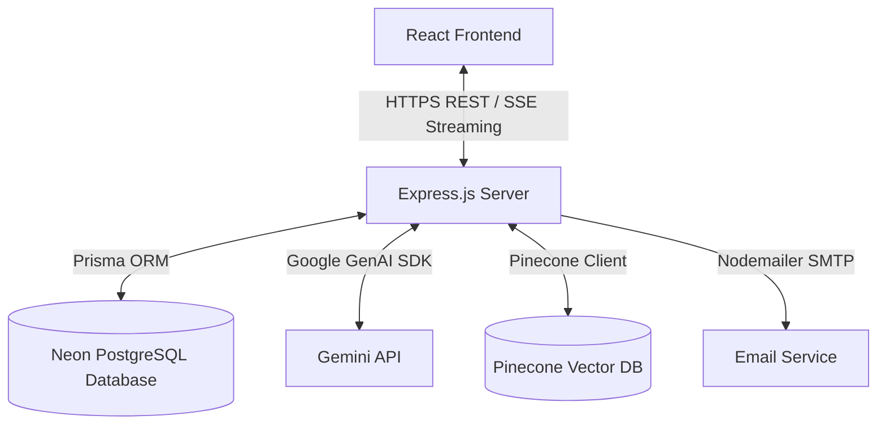
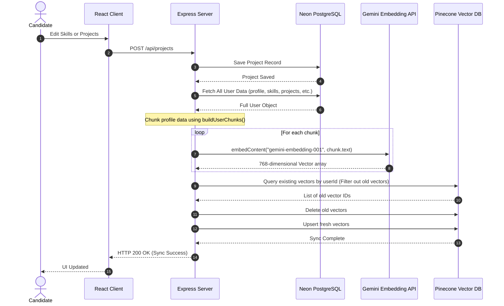
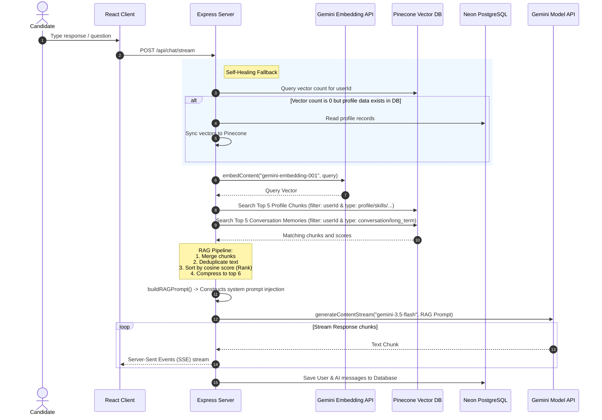

# Solution Architecture

`InterviewAI` is a personalized AI-assisted interview preparation platform. It enables candidates to manage their professional profiles (resumes, projects, skills, education, work experience) and engage in mock interviews with an AI interviewer powered by Gemini, which dynamically references their resume context and past conversation memories using Retrieval-Augmented Generation (RAG).

---

## 1. System Topology

The application utilizes a classic client-server decoupled architecture:



- **Client (React + Vite)**: A dynamic single-page web app styled with Tailwind CSS, utilizing React Router for navigation and React Context for authentication/state management.
- **Server (Express.js + Node.js)**: A lightweight REST API server handling request validation, routing, user authentication, and RAG pipelines.
- **Neon PostgreSQL**: A cloud-hosted serverless PostgreSQL database used for relational storage of user details, profile sections, messages, and long-term memory logs.
- **Pinecone Vector Database**: A high-performance serverless vector database used to store and retrieve dense vector embeddings for profile chunks and conversation memories.
- **Gemini API**: Generates user embeddings (`gemini-embedding-001`) and streams conversational mock interview responses (`gemini-3.5-flash`).

---

## 2. Database Schema (Relational PostgreSQL)

Below is the entity-relationship mapping of the PostgreSQL database managed by [Prisma ORM](file:///d:/Cloud%20vandana%20Ass%202/InterviewAI/server/prisma/schema.prisma):

```
+------------------+         +------------------+
|       User       | 1 --- 1 |     Profile      |
+------------------+         +------------------+
| id (PK)          |         | id (PK)          |
| name             |         | name             |
| email (Unique)   |         | bio              |
| password         |         | githubUrl        |
| googleId         |         | linkedinUrl      |
| createdAt        |         | userId (FK)      |
+------------------+         +------------------+
  | 1       1   1
  |         |   +--------------+
  |         +---------+        |
  | *                 | *      | *
+------------------+  |      +------------------+
|   RefreshToken   |  |      |      Skill       |
+------------------+  |      +------------------+
| id (PK)          |  |      | id (PK)          |
| token (Unique)   |  |      | name             |
| expiresAt        |  |      | userId (FK)      |
| userId (FK)      |  |      +------------------+
+------------------+  |
                      | *
                    +------------------+
                    |     Project      |
                    +------------------+
                    | id (PK)          |
                    | title            |
                    | description      |
                    | techStack        |
                    | userId (FK)      |
                    +------------------+
```

### Table Relations and Descriptions
1. **User**: Core authentication table supporting local credentials and Google OAuth keys.
2. **Profile**: Extended profile details containing bio summaries and social URLs.
3. **Skill, Project, Education, Experience**: User-supplied profile segments that are vectorized into semantic chunks.
4. **Conversation & Message**: Message log history used to record and render conversations on the frontend.
5. **MemorySummary**: Synthesized summaries of past conversations generated by Gemini in the background to serve as long-term memory context.
6. **RefreshToken & PasswordResetToken**: Auth helper records.

---

## 3. Data Synchronization Workflow (DB -> Vector DB)

When a user updates their profile segments (skills, experiences, education, etc.), the data is stored in PostgreSQL and asynchronously synchronized to the vector database.



---

## 4. Chat Generation and RAG Workflow

When the candidate enters a question or response in the mock interview chat, RAG is triggered to synthesize personalized contexts.


