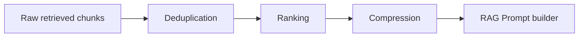

# RAG Pipeline and Memory Architecture

`InterviewAI` implements an advanced, self-healing Retrieval-Augmented Generation (RAG) pipeline combined with dual-tier (conversational and long-term) semantic memory. This architecture ensures the AI interviewer has complete, contextual knowledge of the candidate's professional credentials and past conversation topics.

---

## 1. Data Chunking Strategy (`buildUserChunks.js`)

To enable high-quality semantic retrieval, user profiles are segmented into isolated, contextual chunks using [buildUserChunks.js](file:///d:/Cloud%20vandana%20Ass%202/InterviewAI/server/src/vector/buildUserChunks.js). Segmenting the data ensures that the embedding models generate clean vectors focusing on specific professional aspects.

The profile is parsed into five chunk types:
- **`profile`**: Serialized JSON string containing name, bio, and social urls.
- **`skills`**: A text summary containing a formatted list of all technical skills.
- **`project`**: Individual text blocks detailing the project's title, description, and technology stack.
- **`education`**: Details of college, degree, field of study, and years.
- **`experience`**: Individual text blocks describing professional work, role, company, timelines, and description.

---

## 2. Generating Embeddings (`embeddingService.js`)

Embeddings are generated in [embeddingService.js](file:///d:/Cloud%20vandana%20Ass%202/InterviewAI/server/src/ai/embeddingService.js) using the Google GenAI SDK:
- **Model**: `gemini-embedding-001`
- **Output Dimensionality**: 768 dimensions

```javascript
const response = await genAI.models.embedContent({
    model: "gemini-embedding-001",
    contents: text,
    config: {
        outputDimensionality: 768
    }
});
return response.embeddings[0].values;
```

---

## 3. Vector Database Management (Pinecone)

Vector indices and queries are managed in [pinecone.js](file:///d:/Cloud%20vandana%20Ass%202/InterviewAI/server/src/vector/pinecone.js), with database writes and queries executed as follows:

### A. Synchronization (`syncUserVectors.js`)
When a user updates their profile:
1. User records are loaded from PostgreSQL.
2. Fresh chunks are generated and vectorized sequentially.
3. Old vectors in Pinecone associated with the user are queried and deleted using a metadata filter:
   ```json
   { "userId": "user-id-here", "type": { "$in": ["profile", "skills", "project", "education", "experience"] } }
   ```
4. New vectors are upserted into Pinecone with the ID pattern `${userId}-${chunkType}-${index}`.

### B. Retrieval (`retrieveRelevantChunks.js` & `retrieveConversationMemory.js`)
Two distinct semantic searches are performed for every query:
1. **Profile Retrieval**: Retrives up to 5 profile metadata matching `type: profile | skills | project | education | experience`.
2. **Conversation Memory Retrieval**: Retrieves up to 5 memory vectors matching `memoryType: conversation | long_term_memory`.

---

## 4. Post-Retrieval Pipeline (Deduplication, Ranking & Compression)

Once vector search returns raw matches from Pinecone, the results are refined through a multi-stage memory pipeline in [ragService.js](file:///d:/Cloud%20vandana%20Ass%202/InterviewAI/server/src/ai/ragService.js):



1. **Deduplication** ([deduplicateMemory.js](file:///d:/Cloud%20vandana%20Ass%202/InterviewAI/server/src/ai/deduplicateMemory.js)): Trims, lowercases, and filters out identical textual chunks to prevent token wastage.
2. **Ranking** ([rankMemory.js](file:///d:/Cloud%20vandana%20Ass%202/InterviewAI/server/src/ai/rankMemory.js)): Sorts chunks by their Pinecone similarity match scores descending:
   $$\text{score} = \cos(\theta) = \frac{\mathbf{A} \cdot \mathbf{B}}{\|\mathbf{A}\| \|\mathbf{B}\|}$$
3. **Compression** ([compressMemory.js](file:///d:/Cloud%20vandana%20Ass%202/InterviewAI/server/src/ai/compressMemory.js)): Extracts the top 6 most relevant items. This prevents prompt pollution and respects context constraints.

---

## 5. Dual-Tier Memory and Long-Term Memory Synthesis

To simulate a real human interviewer, the system maintains two tiers of conversation memory:

### A. Short-Term Memory
Saved immediately in Pinecone via [storeConversationMemory.js](file:///d:/Cloud%20vandana%20Ass%202/InterviewAI/server/src/vector/storeConverstaionMemory.js) for every prompt-response exchange.

### B. Long-Term Memory Pipeline
After conversations conclude, an background routine synthesizes long-term memory via [storeLongTermMemory.js](file:///d:/Cloud%20vandana%20Ass%202/InterviewAI/server/src/ai/storeLongTermMemory.js):
1. **Summarization** ([summarizeConversationMemory.js](file:///d:/Cloud%20vandana%20Ass%202/InterviewAI/server/src/ai/summarizeConversationMemory.js)): Gemini synthesizes a concise summary of the candidate's goals, skills, interests, and mock interview performance.
2. **Importance Scoring** ([scoreMemoryImportance.js](file:///d:/Cloud%20vandana%20Ass%202/InterviewAI/server/src/ai/scoreMemoryImportance.js)): The summary is analyzed for key terms (`career`, `goal`, `interview`, `experience`, etc.) and assigned an importance score between `0.3` and `1.0`.
3. **Storage**: The summary is saved in PostgreSQL as a `MemorySummary` record, embedded using `gemini-embedding-001`, and upserted to Pinecone under metadata tag `memoryType: long_term_memory`.

---

## 6. Self-Healing Fallback Logic

To guarantee structural resilience and prevent empty prompts in cases of vector deletion or platform migration, the server features a self-healing engine inside [generateRAGStream.js](file:///d:/Cloud%20vandana%20Ass%202/InterviewAI/server/src/ai/generateRAGStream.js):

- On chat initiation, the server queries Pinecone for the user's vector count.
- If the vector count is `0`, but the user has registered profile information in the PostgreSQL database, the server automatically triggers:
  ```javascript
  console.log(`[Self-Healing] User has details in DB. Syncing vectors to Pinecone...`);
  await syncUserVectors(userId);
  ```
- This dynamically rebuilds the vector space on the fly, preventing RAG degradation.
